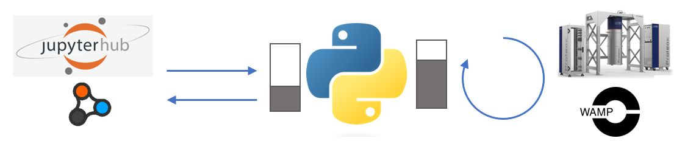
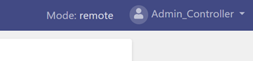

## Proteox QCoDeS

#### Why is this different to a standard QCoDeS driver?
Proteox refrigerators are controlled with the `oi.DECS` system control software. This is designed to operate in an asynchronous fashion using WebSockets.

Many `QCoDeS` drivers are written for `VISA` instruments that have synchronous behaviour.

It is possible to implement the WAMP messaging protocol directly from `QCoDeS`, but for simple (single threaded) instrument drivers this can result in time-out issues if the communication channel is unactive for some time.

An alternative approach is to make `oi.DECS` *'look like'* a standard `VISA` instrument. To accomplish this, a simple socket server can be inserted between `QCoDeS` and `oi.DECS`. A pair of python `queue.Queue` queues are provided for inter-process communication between the socket server and the WAMP API. This simple TCP socket server is provided by the `DECS<->VISA` python application. 



## To connect to your system control software ('oi.DECS') using QCoDeS

1.  Setup the `decsvisa` simple TCP socket server. Follow the setup and configuration steps detailed in the `README.md` file included within the decsvisa directory. This decsvisa directory can be found at `qcodes/instrument_drivers/Oxford_Instruments/decsvisa`.

2.  In the `QCoDeS` driver file `Proteox.py`, add the file path of `decs_visa.py` as shown below:

    ````python
    #############################################
    #    Configuration settings required     #
    #############################################

    # supply the file path from your working directory to the decs_visa.py file
    decs_visa_path = "qcodes/instrument_drivers/OxfordInstruments/decsvisa/src/decs_visa.py"

    #############################################
    ````

3. In the `QCoDeS` driver file `Proteox.py`, configure the system settings to be correct for your system. 

    ````python
    #############################################
    #    System configuration settings     #
    #############################################

    # Does the system have a superconducting
    # magnet fitted:
    SYSTEM_HAS_MAGNET=True

    # If there is a superconducting magnet
    # is it fitted with a switch:
    MAGNET_HAS_SWITCH=False

    # Dual PTR (ProteoxLX) system:
    DUAL_PTRS_FITTED=False # not currently used

    # Does the system have the < 5mK; > 900 uW
    # dilution unit installed
    DUAL_TURBO_FITTED=False # not currently used

    # Does the system have a 3He flow meter
    HE3_FLOW_METER_FITTED=True

    #############################################
    ````

4.  Ensure that `oi.DECS` is in remote mode, and that there is no current controlling session.

    
    
    **NB** - You will need to be logged in as `Admin_Controller` to change from ‘local’ to ‘remote’ modes.

5.  Import the `QCoDeS` driver and connect to `oi.DECS` as follows:

    ````python
    from qcodes_contrib_drivers.drivers.OxfordInstruments.Proteox import oiDECS
    Proteox = oiDECS('Proteox')
    ````
Once connected, the driver can be used in the same way as any other `QCoDeS` driver. See the file `docs/examples/OxfordInstruments_Proteox.ipynb` for an example. When you close the connection, e.g. `Proteox.close()`, this will also close the WAMP connection established by `DECS<->VISA`, as well as the socket server it launches (see the `DECS<->VISA` README for further details). 

Note: If running with oi.DECS firmware =< 0.5.1, ingore the error "Error parsing response: Length of data record inconsistent with record type" when setting the magnet target. You will recieve this error because the data sent back from oi.DECS won't be handled correctly for firmware versions =< 0.5.1. The magnet target should still have been set.


#### Troubleshooting

If running on a Windows platform, debug/information produced by the `DECS<->VISA` simple TCP socket server will be outputted to a `decs_visa.log file` created in your working directory. If struggling to establish a connection please check this log file for information on why.

Note: The `DECS<->VISA` simple TCP socket server is started using the python `subprocess` package. If struggling to start the subprocess check whether python is called "python3" or "python" on your machine. This may need to be ammended in the lines shown below in the file `Proteox.py`.

````python
if running_on.startswith("Windows"):
    print(f"Running on {running_on} - start subprocess without PIPEd output")
    subprocess.Popen(["python", decs_visa_path])
else:
    print(f"Running on {running_on} - start subprocess with PIPEd output")
    subprocess.Popen(["python3", decs_visa_path], stdout=subprocess.PIPE)
````
The default is "python" for Windows and "python3" for Linux and MAC.
