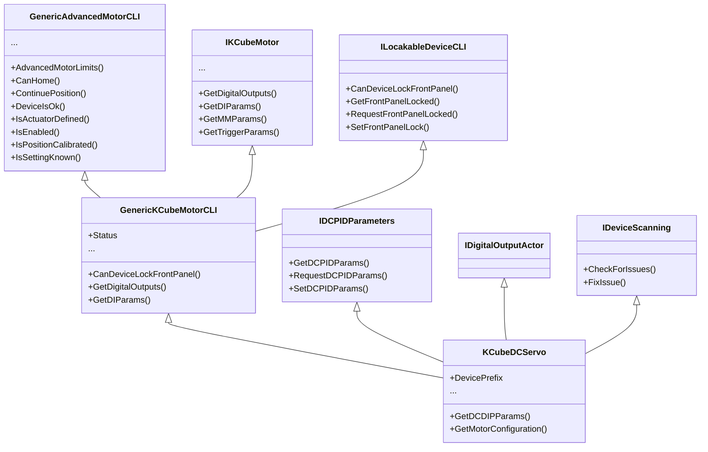

***
**Thorlabs .NET API - Qcodes Implementation Drivers**

***

The aim of this Thorlabs .Net API **Qcodes Implementation** is to be as modular as the .Net API itself. To accomplish this, the implementation mimics the Thorlabs .Net API inheritance structure. This manual provides an overview of the key concepts and naming conventions used in the implementation, and it concludes with a [Practical Implementation Example](#Practical-Implementation-Example) that demonstrates how to transform a Thorlabs device into a Qcodes Instrument, providing a practical application of the principles discussed.

# Terminology

## Qcodes Implementation Terms

### Object

An object in the Thorlabs .Net API serves as an interface for various functionalities, which may include **attributes**, **accessors**, or nested **objects**.

### Attribute

Attributes represent device-related values like position or current. 
Note that .Net Enums and Decimals, while technically objects, are considered attributes.

### Accessor

An accessor is a function used for either fetching (`getter`) or modifying (`setter`) an object or attribute. 

### Implementation

**Implementation** abbreviates:  Qcodes Implementation of the Thorlabs .NET API

## Thorlabs .Net API Terms

### Core Device and Channel Device

- **Core Device (`Thorlabs API: Device vs. Channel`)**: This interface represents the entire physical unit and is responsible for handling global operations. It serves as the primary interface for actions and properties that affect the device as a whole, like handling communication.
- **Channel Device (`IGenericDeviceCLI`)**: This interface is designed to manage the specific functionalities of devices that have multiple channels. Each channel is a controllable entity within the device, such as an individual motor axis in a multi-axis stage.

#### Single-Channel and Multi-Channel Devices

- **Single-Channel Devices**: Here, the design uses a **mixin** approach, where the channel functionality is directly mixed into the core device class. This means that the core device class includes the channel interface, indicating that the single channel is an intrinsic part of the core device itself.
- **Multi-Channel Devices**: In this case, the design employs **composition**. The core device acts as the composite object that "has" multiple channels devices, each represented as a separate object or module. 

####  Thorlabs .Net API Terms Clarification

When navigating the Thorlabs API documentation, be aware that the terms  for core devices and channels are sometimes interchangeably referred to  as 'device'. In instances where a distinction is made, the documentation typically uses 'device' and 'channel' to differentiate the two. This  terminology can be somewhat confusing, as it may not be immediately  evident whether 'device' refers to the entire unit or just a single  channel within it.

## Device Settings and Device Configuration

### Device Settings

**Device Settings** refer to a set of configurable attributes specific to a **Channel** within the device. These settings, which dictate how the channel operates, can be adjusted directly via the API or through the Thorlabs Kinesis software.

For example, motor device settings contain organized groups such as:

- **Home Settings**: Control the initialization position and behavior of the motor.
- **Jog Settings**: Define the parameters for incremental movements.
- **Limit Settings**: Set the boundaries for motor operation to prevent overtravel.

Settings such as `Default Device Startup Settings` and `Custom Device Startup Settings` illustrate how users can specify operational states at power-up. The `DeviceSettingsName` for a motor typically identifies the device settings for the particular actuator in use.

> While the specific settings available may vary between device types, the overarching methodology for interacting with and adjusting these settings remains consistent across the Thorlabs product line.

Consult the Kinesis help documentation for more information regarding settings: `%ProgramFiles%\Thorlabs\Kinesis\Thorlabs.MotionControl.KinesisHelp.chm`

### Device Configuration

**Device Configuration** concerns, among other thins, the application of **Device Settings** to a **Channel**. It includes options to select the **Device Settings** being apply at startup.

Within the Thorlabs .Net API, you'll configure options such as:

- **DeviceSettingsName**: Assigns a specific set of settings. For a motor, typically linked to the actuator being controlled.

You can also select the `startupSettingsMode`, which dictates the behavior upon device startup:

- `UseDeviceSettings`: Loads settings saved on the device's internal memory.
- `UseFileSettings`: Retrieves settings from a file on the local computer.
- `UseConfiguredSettings`: Defaults to the user's prior selection made within the Kinesis software.

To manage these configurations in the Kinesis Software:

1. Ensure device-persisted settings are not the default: 
    `File -> Options -> Application` and uncheck `[ ] Use Device Persisted settings`.
2. Select startup settings mode indiviually:
   `File -> Options -> Devices -> Startup Settings` 

Remember, the Thorlabs API may use the term 'device' to describe both core devices and channels. When you encounter 'device' in the documentation, consider the context to determine if it refers to the core device or a channel.

# Implementation Naming Conventions

## Classes representing a physical Device

Classes that directly represent physical devices should:

- Follow the Qcodes [Naming Instruments Guide](https://qcodes.github.io/Qcodes/examples/writing_drivers/Creating-Instrument-Drivers.html#Naming-Instruments).
- Append `_DotNet` at the end of the filename for clear differentiation from other implementations.

**Template**

```
...\Thorlabs\Thorlabs_{Model}_DotNet.py
```

Inside this file class names should adhere to the Qcodes [Naming Instruments Guide](https://qcodes.github.io/Qcodes/examples/writing_drivers/Creating-Instrument-Drivers.html#Naming-Instruments).

### Examples:

For the namespace `Thorlabs::MotionControl::Benchtop::StepperMotorCLI`:

- The class `BenchtopStepperMotor` should be named `ThorlabsBSCxxx`
- The class `StepperMotorChannel` should be named `ThorlabsBSCxxxChannel` 

* Both should reside in:

  ```
  ...\Thorlabs\Thorlabs_BSCxxx_DotNet.py
  ```
## Other .Net API classes

Classes that do not directly represent a device should:

- Be located in the `...\Thorlabs\private\DotNetAPI` directory.
- Have their filenames formatted by:
  * remove prefix `Thorlabs::MotionControl::` 
  * replace all `::` with `_`

**Example:**

For the namespace `Thorlabs::MotionControl::GenericMotorCLI::AdvancedMotor`:

- The corresponding filename should be:

  ```
  ...\Thorlabs\private\DotNetAPI\GenericMotorCLI_AdvancedMotor.py
  ```

Class names within these files should match the .NET API naming and follow its inheritance structure.

Example Class Definition in file `GenericMotorCLI_AdvancedMotor.py`:

```python
class GenericAdvancedMotorCLI(GenericMotorCLI):
    # Class implementation
```
## Implementation classes

The classes not directly representing a .Net API class are located in this file:

```
...\Thorlabs\private\DotNetAPI\qcodes_thorlabs_integration.py
```

# Class Descriptions

The classes described here form the core of the Thorlabs .NET API integration with Qcodes.

## ThorlabsQcodesInstrument

The `ThorlabsQcodesInstrument` class is the core component for integrating Thorlabs devices. It aims to replicate the functionality of the [Thorlabs pythonnet_template](https://github.com/Thorlabs/Motion_Control_Examples/blob/main/Python/pythonnet_template.py), adapting it to Qcodes.

Waiting for initialization, start polling, enabling and configuring the Device will not be handled in this class, because it is done at **Channel** level in  [IGenericDeviceCLI](#IGenericDeviceCLI).

It will perform:

* [DLL Handling](#DLL-Handling), 
* [API Interface initialization](#API-Interface-initialization)

* [Connection and simulation management](#Connection-and-simulation-management)

* [Post Connection Method](#Post-Connection-Method)
* .Net API [Attribute Access](#Attribute-Access)

### DLL Handling

`ThorlabsQcodesInstrument` allows for DLL handling and makes the .Net API classes accessible via `_dll.<class_name>`

The instance variable `dll_directory` is optional and by default will refer to `%ProgramFiles%\Thorlabs\Kinesis\`  via Environment Variable.

The common DLL `Thorlabs.MotionControl.DeviceManagerCLI.dll` is already referenced.
The common classes `DeviceManagerCLI`, `DeviceConfiguration` and `SimulationManager` are already imported.

Overwrite `_import_device_dll` to:

+ reference device specific DLLs with: `_add_dll(dll_filename)` 
+ import .Net API classes with: `_import_dll_class(namespace, class_name)`

**Example**

The Thorlabs pythonnet examples usually look like this:

```pyton
clr.AddReference("C:\\Program Files\\Thorlabs\\Kinesis\\Thorlabs.MotionControl.DeviceManagerCLI.dll")
from Thorlabs.MotionControl.DeviceManagerCLI import *
```

This has to be realized differently, since `import *` will only work on a module level and the DLL directory is set by instance variable. This is why classes will be imported explicitly and the directory is omitted. The above example can translate to:

```python
self._add_dll('Thorlabs.MotionControl.DeviceManagerCLI.dll')
self._import_dll_class('Thorlabs.MotionControl.DeviceManagerCLI', 'DeviceManagerCLI')
self._import_dll_class('Thorlabs.MotionControl.DeviceManagerCLI', 'DeviceConfiguration')
self._import_dll_class('Thorlabs.MotionControl.DeviceManagerCLI', 'SimulationManager')
```

### API Interface initialization

Overwrite `_get_api_interface_from_dll` and return the device specific API object, to allow `_api_interface` to be set.

**Example**

```python
def _get_api_interface_from_dll(self, serial_number: str):
    return self._dll_interface.StepperMotorCLI.BenchtopStepperMotor.CreateBenchtopStepperMotor(serial_number)
```

### Connection and simulation management 

After DLL Handling `ThorlabsQcodesInstrument`  will use `SimulationManager.Instance.InitializeSimulations()` depending on the instance variable `simulation`.

After that it will connect to the device using instance variable `serial_number`

It will close the device connection and `UninitializeSimulations` via pythons `atexit` module.

### Post Connection Method

After connection `ThorlabsQcodesInstrument` will add the parameters `model`, `serial_number`  and `firmware_version` and overwrite `get_idn`, which accesses these parameters to produce expected behavior.

If you want to perform tasks such as model verification after establishing a connection, override the `_post_connection` method.
## IGenericDeviceCLI

The `IGenericDeviceCLI` is a mixin class within the QCoDeS framework, serving as the foundational interface for controlling Thorlabs devices. Its flexible design allows it to be:

- Mixed into `Instrument` for single-channel devices, encapsulating the device as a unified class.
- Composed with `InstrumentChannel` for multi-channel devices, bestowing individual channels with device-specific functionality.

This design ensures that the `IGenericDeviceCLI` can adapt to the structure of any Thorlabs device, whether it operates as a single unit or as part of a complex multi-channel system.

### Instance Variables

* `polling_rate_ms`: Defines the polling rate in milliseconds.
* `api_interface`: Sets `_api_interface` if provided. Use if `IGenericDeviceCLI` is a **Channel**
  confer: [Thorlabs Device or Channel API Objects](#Thorlabs-Device-or-Channel-API-Objects)
* `startup_mode_value`: Provide .Net Enum `_startup_mode` for [Post Enable Method](Post-Enable-Method)

### Sequence of Initialization Actions

The `IGenericDeviceCLI` class manages the following actions during the initialization sequence:

* **Wait for Settings Initialization**: Ensures that the settings or initialized by the device.
* **Start Polling**: Begins polling the device/channel at a rate defined by the `polling_rate_ms` instance variable.
* **Enable Device**: Activates the **Channel**, allowing it to move and respond to commands.
* **Post Enable Method**: Calls the overridden `_post_enable` method to perform any additional setup required.

### Post Enable Method

After enabling a Thorlabs device or channel and starting polling, you'll need to configure it using the `_post_enable` method. This is where you apply the necessary [Device Settings and Device Configuration](https://chat.openai.com/c/d9050abd-dfdb-4e66-a174-76860e84bce6#Device-Settings-vs-Device-Configuration) specific to each **Channel**.

#### Overriding the Post Enable Method

Customize the `_post_enable` method for each **Channel** to ensure it's correctly set up. This is where you can also pass `_startup_mode` to the channel-specific LoadConfiguration Method, if you've provided a `startup_mode_value` as an instance variable. Use `_startup_mode` to access the appropriate .NET enum value and pass it to the channel-specific configuration method, where it probably is called   `startupSettingsMode` .

For **single-channel devices**, where the channel's functionality is incorporated directly into the core device class, `_post_enable` will configure the sole channel.

For **multi-channel devices**, each channel might require its own `_post_enable`, which can be managed within their respective channel classes.

Here is a template for overriding `_post_enable`:

```python
def _post_enable(self):
    """
    This method can be overwritten by a subclass.
    Will run after polling has started and the device/channel is enabled.
    """
    # Load any configuration settings needed by the device/channel
	serial = self._serial_number
	mode = self._startup_mode
    self._configuration = (
    	self._api_interface.<LoadConfigurationMethod>(serial, mode))

```

#### Cleanup

The `IGenericDeviceCLI` will stop polling the device/channel during the cleanup process using Python's `atexit` module.


## ThorlabsMixin and subclasses

Classes that inherit from `ThorlabsMixin` should also be subclasses of Qcodes `InstrumentBase`.
This includes: `Instrument`, `InstrumentChannel`, and `InstrumentModule`.

Within these derived classes, the associated .NET API object can be accessed in one of two ways:

- **Direct Access to API Object:**
  If the API offers direct access to the API object, it will be named: `_api_interface`
- **API Object access via Getters and Setters:**
  If the API provides accessors (getters and setters), these will be named: `_api_interface_getter` and if not read-only: `_api_interface_setter`

**Note**: For the method not applicable, these are set to `None`.

### Attribute Access

To get or set the value of an attribute, use the following methods: 

`_get_thorlabs_attribute`, `_get_thorlabs_decimal`, `_get_thorlabs_enum`
`_set_thorlabs_attribute`, `_set_thorlabs_decimal`, `_set_thorlabs_enum`

**Example using Attribute Keys:**

```python
self.add_parameter(
    "hard_limit_action_ccw",
    get_cmd=lambda: self._get_thorlabs_enum('AnticlockwiseHardwareLimit'),
    set_cmd=lambda x: self._set_thorlabs_enum(x, 'AnticlockwiseHardwareLimit'),
    vals=Enum('Ignore', 'Make', 'Break', 'Home_Make', 'Home_Break', 'PMD_Index')
)
```

**Example using Getter and Setter Names:**

```python
self.add_parameter(
    'backlash',
    get_cmd=lambda: self._get_thorlabs_decimal(getter_name='GetBacklash'),
    set_cmd=lambda x: self._set_thorlabs_decimal(x, setter_name='SetBacklash'),
    unit=self.advanced_limits.length_unit()
)
```

### Thorlabs Device or Channel API Objects

The `ThorlabsMixin` class is intended for Thorlabs Devices or Channels, which allow direct object access. Since this object may not be accessible at instance creation, it must be set using `_set_api_interface(api_interface)` before using other methods.

### Thorlabs Attribute Objects

The class `ThorlabsObjectWrapper` is designed for objects that contain multiple Device or Channel attributes.

You can create a `ThorlabsObjectWrapper` object using either:

* Object Key
* Getter Name and optional: Setter Name

**Example using Object Key**

```python
class StatusBase(ThorlabsObjectWrapper):
    def __init__(
        self, parent, name,
        object_key='Status',
        getter_name=None,
        setter_name=None,
        **kwargs
    ):
        super().__init__(parent, name, object_key, getter_name, setter_name, **kwargs)
```

**Example using Getter and Setter Names**

```python
class LimitSwitchParametersBase(ThorlabsObjectWrapper):
    def __init__(
        self, parent, name,
        object_key=None,
        getter_name='GetLimitSwitchParams',
        setter_name='SetLimitSwitchParams',
        **kwargs
    ):
        super().__init__(parent, name, object_key, getter_name, setter_name, **kwargs)
```

These examples allow for flexibility. Object Key, Getter and Setter Names could be changed when initializing modules. When left default adding Submodules is very easy (see Example below).

**Example adding ThorlabsObjectWrapper Submodule**

```python
motor_position_limits = LimitsData(self, 'motor_position_limits')
self.add_submodule('motor_position_limits', motor_position_limits)
```


# Practical Implementation Example

This examples aims to show how [Thorlabs KDC101 pythonnet expamle](https://github.com/Thorlabs/Motion_Control_Examples/blob/main/Python/KCube/KDC101/kdc101_pythonnet.py) is transformed to a Qcodes instrument.

## Template

Copy and modify Template located under: qcodes_contrib_drivers\drivers\Thorlabs\Thorlabs_Template_DotNet.py

## Naming

First, the relevant class in the Thorlabs .Net API Documentation has to be identified.
`%ProgramFiles%\Thorlabs\Kinesis\Thorlabs.MotionControl.DotNet_API.chm`

For the KDC101 device, the class is named `KCubeDCServo`. The inheritance structure for this class is detailed in the **KCubeDCServo Class Reference**.

### KCubeDCServo Inheritance diagram



Following the [Implementation Naming Conventions](#Implementation-Naming-Conventions) above results in:

* file name: `...\Thorlabs\Thorlabs_KDC101_DotNet.py`
  * containing class named: `ThorlabsKDC101`

`GenericAdvancedMotorCLI` is already (partially) implemented, for `IDigitalOutputActor` no Information or Namespace provided.

To get to `GenericAdvancedMotorCLI` at least `GenericKCubeMotorCLI` has to be implemented.
If all functionality of all classes is needed the resulting names and locations are:

```
...
|-- Thorlabs
    |-- Thorlabs_KDC101_DotNet.py
        |-- class ThorlabsKDC101
    |-- private
        |-- DotNetAPI
            |-- DeviceManagerCLI.py
                |-- class IDeviceScanning
                |-- class ILocakableDeviceCLI
            |-- GenericMotorCLI_AdvancedMotor.py
                |-- class GenericAdvancedMotorCLI
            |-- GenericMotorCLI_ControlParameters.py
                |-- class IDCPIDParameters
            |-- GenericMotorCLI_KCubeMotor.py
                |-- class GenericKCubeMotorCLI
                |-- class IKCubeMotor
```

The classes can be implemented as skeletons or partial implementations, but if a functionality is missing it should be implemented in the corresponding class.

The beginning of  `...\Thorlabs\Thorlabs_KDC101_DotNet.py` now looks like this:

```python
from .private.DotNetAPI.GenericMotorCLI_ControlParameters import IDCPIDParameters
from .private.DotNetAPI.DeviceManagerCLI import IDeviceScanning
from .private.DotNetAPI.GenericMotorCLI_KCubeMotor import GenericKCubeMotorCLI
from .private.DotNetAPI.qcodes_thorlabs_integration import ThorlabsQcodesInstrument


class ThorlabsKDC101(IDCPIDParameters, IDeviceScanning, GenericKCubeMotorCLI, ThorlabsQcodesInstrument):
```

Now, following the [ThorlabsQcodesInstrument](#ThorlabsQcodesInstrument) documentation and looking through [Thorlabs KDC101 pythonnet example](https://github.com/Thorlabs/Motion_Control_Examples/blob/main/Python/KCube/KDC101/kdc101_pythonnet.py):

## [DLL Handling](DLL-Handling)

line 6 to 11 (respecting line 27):

```python
 6: clr.AddReference("C:\\Program Files\\Thorlabs\\Kinesis\\Thorlabs.MotionControl.DeviceManagerCLI.dll")
 7: clr.AddReference("C:\\Program Files\\Thorlabs\\Kinesis\\Thorlabs.MotionControl.GenericMotorCLI.dll")
 8: clr.AddReference("C:\\Program Files\\Thorlabs\\Kinesis\\ThorLabs.MotionControl.KCube.DCServoCLI.dll")
 9: from Thorlabs.MotionControl.DeviceManagerCLI import *
10: from Thorlabs.MotionControl.GenericMotorCLI import *
11: from Thorlabs.MotionControl.KCube.DCServoCLI import *

27:        device = KCubeDCServo.CreateKCubeDCServo(serial_no)
```

translate to:

```python
def _import_device_dll(self):
    """Import the device-specific DLLs and classes from the .NET API."""
    self._add_dll('Thorlabs.MotionControl.GenericMotorCLI.dll')
    self._add_dll('Thorlabs.MotionControl.KCube.DCServoCLI.dll')
    self._import_dll_class('Thorlabs.MotionControl.KCube.DCServoCLI', 'KCubeDCServo')
```

## [API Interface initialization](#API-Interface-initialization)

line 27 tranlsates to:

```python
def _get_api_interface_from_dll(self, serial_number: str):
    """Retrieve the API interface for the Thorlabs device using its serial number."""
    return self._dll_interface.KCubeDCServo.CreateKCubeDCServo(serial_number)
```

## [Post Connection Method](#Post-Connection-Method)

```python
def _post_connection(self) -> None:
    """
    Will run after after establishing a connection, updating 'get_idn'
    and adding parameters 'model', 'serial_number' and 'firmware_version'.
    """
    knownmodels = [
        'KDC101'#,
        #'KDC101 (Simulated)'
    ]
    if self.model() not in knownmodels:
        raise ValueError(f"'{model}' is an unknown model.")
```

## [Post Enable Method](#Post-Enable-Method)

line 47 to 55:

```python
47:        # Before homing or moving device, ensure the motor's configuration is loaded
48:        m_config = device.LoadMotorConfiguration(serial_no,
49:                                                 DeviceConfiguration.DeviceSettingsUseOptionType.UseFileSettings)
50:
51:        m_config.DeviceSettingsName = "PRMTZ8"
52:
53:        m_config.UpdateCurrentConfiguration()
54:
55:        device.SetSettings(device.MotorDeviceSettings, True, False)
```

translate to:

```python
def _post_enable(self):
    """
    This method can be overwritten by a subclass.
    Will run after polling has started and the device/channel is enabled.
    """
    # Load any configuration settings needed by the device/channel
    serial = self._serial_number
    mode = self._startup_mode
    self._configuration = (
        self._api_interface.LoadMotorConfiguration(serial, mode))

    self._configuration.DeviceSettingsName = self._actuator_name
    self._configuration.UpdateCurrentConfiguration()

    self._api_interface.SetSettings(self._api_interface.MotorDeviceSettings, True, False)
    sleep(0.5)
```
